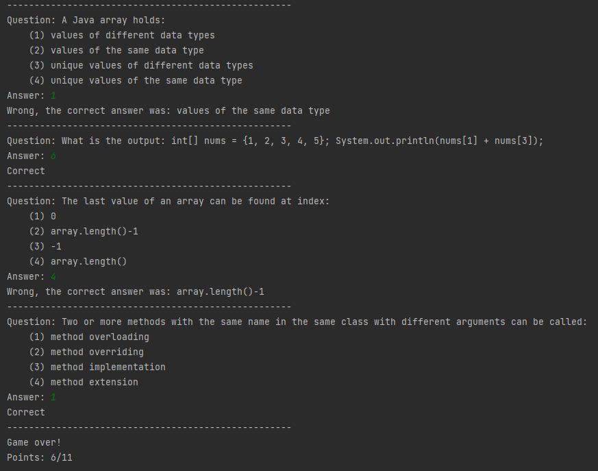
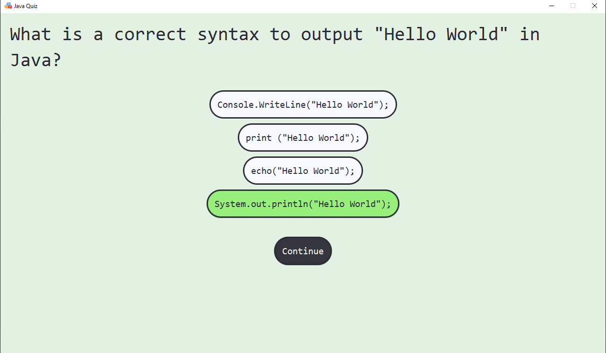

# Quiz game

A very simple quiz application with questions read from a file.

There are two ways to run the application:

### Terminal

Run the main method in the `QuizConsole` in under the `src/application` package.
Interact by typing in the terminal.

### JavaFX Application

Run the main method in the `QuizApp` class in the `src/application` package.
Interact by clicking the right (or wrong) answer button, or writing the answer in the input box and pressing submit.

 1. If the answer is correct the background and selected answer will turn
   green.
   
 2. If the answer is wrong the background and selected answer will
   turn red and the corrected answer will be green, or in the case of a
   written answer, the correct answer will be displayed under the input
   field.
   
## Make your own quiz file
Refer to the example file for a syntax demo - [/src/files/javaQuestions.txt](/src/files/javaQuestions.txt)
- The first line of the file should contain the title of the quiz, which will be shown on the window title. Example: *Java Quiz*, *Movie Trivia*, *Quiz about making quizes*, ...
- Add your questions. The fields are separated with vertical lines: `|`. This means this symbol cannot be used in a question or answer.
	 - Type of question
		 - `w` - written - This question requires input from the user.
		 - `m` - multiple choice - This question shows multiple options and only one is correct.
	- Question
	- Correct answer
		- For multiple choice questions the correct answer is followed by the other wrong options. Notice that during the quiz, the options will appear in a random order, so this is not a problem! 
